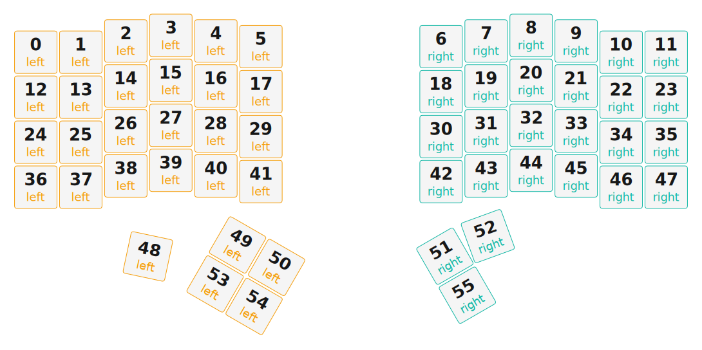

# ZMK Configuration for charybdis

*Generated by Shield Wizard for ZMK*



Download compiled firmware from the Actions tab. <https://zmk.dev/docs/user-setup#installing-the-firmware>

Edit your keymap <https://zmk.dev/docs/keymaps>.
User keymap is located at [`config/charybdis.keymap`](config/charybdis.keymap).

-----

<details>
<summary>
Shield Wizard Debug Information
</summary>

In case of broken configuration, here is the Shield Wizard internal data used to generate this configuration:

Commit: 8a52249f61161469b6d90ed8c80c4aa52b9f3858

```json
{"name":"charybdis","shield":"charybdis","dongle":false,"modules":[],"layout":[{"id":"01KJNJFDXCB8KGGRG8W0MJSKC0","part":0,"row":0,"col":0,"w":1,"h":1,"x":0,"y":0.375,"r":0,"rx":0,"ry":0},{"id":"01KJNJFDXCDV16BT61JAWM0D8Z","part":0,"row":0,"col":1,"w":1,"h":1,"x":1,"y":0.375,"r":0,"rx":0,"ry":0},{"id":"01KJNJFDXCMVQQ3PGYRZA9V6V4","part":0,"row":0,"col":2,"w":1,"h":1,"x":2,"y":0.125,"r":0,"rx":0,"ry":0},{"id":"01KJNJFDXC290KM7CS84CYN1CW","part":0,"row":0,"col":3,"w":1,"h":1,"x":3,"y":0,"r":0,"rx":0,"ry":0},{"id":"01KJNJFDXC78S232Q4HST3Q0DH","part":0,"row":0,"col":4,"w":1,"h":1,"x":4,"y":0.125,"r":0,"rx":0,"ry":0},{"id":"01KJNJFDXCS6R3CZ7Y2PGD9FR3","part":0,"row":0,"col":5,"w":1,"h":1,"x":5,"y":0.25,"r":0,"rx":0,"ry":0},{"id":"01KJNJFDXCGJ3M6B8CWC2T2XFC","part":1,"row":0,"col":7,"w":1,"h":1,"x":9,"y":0.25,"r":0,"rx":0,"ry":0},{"id":"01KJNJFDXCB06QHD866QG3S9QQ","part":1,"row":0,"col":8,"w":1,"h":1,"x":10,"y":0.125,"r":0,"rx":0,"ry":0},{"id":"01KJNJFDXCVGK0HR4XR04HX2JP","part":1,"row":0,"col":9,"w":1,"h":1,"x":11,"y":0,"r":0,"rx":0,"ry":0},{"id":"01KJNJFDXC9P6P7QQMPFSXM758","part":1,"row":0,"col":10,"w":1,"h":1,"x":12,"y":0.125,"r":0,"rx":0,"ry":0},{"id":"01KJNJFDXCWS9660E5PB5H794K","part":1,"row":0,"col":11,"w":1,"h":1,"x":13,"y":0.375,"r":0,"rx":0,"ry":0},{"id":"01KJNJFDXCXSRTMK8667ZBVV44","part":1,"row":0,"col":12,"w":1,"h":1,"x":14,"y":0.375,"r":0,"rx":0,"ry":0},{"id":"01KJNJFDXCPNH2C6CM2WPEC90T","part":0,"row":1,"col":0,"w":1,"h":1,"x":0,"y":1.375,"r":0,"rx":0,"ry":0},{"id":"01KJNJFDXCNETRVSMBWQT8WVVP","part":0,"row":1,"col":1,"w":1,"h":1,"x":1,"y":1.375,"r":0,"rx":0,"ry":0},{"id":"01KJNJFDXCGA3AAAGGXSSGYN0D","part":0,"row":1,"col":2,"w":1,"h":1,"x":2,"y":1.125,"r":0,"rx":0,"ry":0},{"id":"01KJNJFDXCY0ACEMMJA0AX87DA","part":0,"row":1,"col":3,"w":1,"h":1,"x":3,"y":1,"r":0,"rx":0,"ry":0},{"id":"01KJNJFDXCDWAX0FH9EMQGA9JZ","part":0,"row":1,"col":4,"w":1,"h":1,"x":4,"y":1.125,"r":0,"rx":0,"ry":0},{"id":"01KJNJFDXCXX5SWCC1A3TJB652","part":0,"row":1,"col":5,"w":1,"h":1,"x":5,"y":1.25,"r":0,"rx":0,"ry":0},{"id":"01KJNJFDXC2CR3T4WQ121MBDDP","part":1,"row":1,"col":7,"w":1,"h":1,"x":9,"y":1.25,"r":0,"rx":0,"ry":0},{"id":"01KJNJFDXC8BM93692R6VWR98P","part":1,"row":1,"col":8,"w":1,"h":1,"x":10,"y":1.125,"r":0,"rx":0,"ry":0},{"id":"01KJNJFDXCWSN14C57HM552RW5","part":1,"row":1,"col":9,"w":1,"h":1,"x":11,"y":1,"r":0,"rx":0,"ry":0},{"id":"01KJNJFDXCFN907QEE38W46FV5","part":1,"row":1,"col":10,"w":1,"h":1,"x":12,"y":1.125,"r":0,"rx":0,"ry":0},{"id":"01KJNJFDXCGR6VGJ1G7XD22TYQ","part":1,"row":1,"col":11,"w":1,"h":1,"x":13,"y":1.375,"r":0,"rx":0,"ry":0},{"id":"01KJNJFDXCYVXWQY4WYH1VXZ6T","part":1,"row":1,"col":12,"w":1,"h":1,"x":14,"y":1.375,"r":0,"rx":0,"ry":0},{"id":"01KJNJFDXCKP4CFCTJG4DSWYCC","part":0,"row":2,"col":0,"w":1,"h":1,"x":0,"y":2.375,"r":0,"rx":0,"ry":0},{"id":"01KJNJFDXC1Z2CXHRBXETCD3P7","part":0,"row":2,"col":1,"w":1,"h":1,"x":1,"y":2.375,"r":0,"rx":0,"ry":0},{"id":"01KJNJFDXCG59D8FJ401JP34Y9","part":0,"row":2,"col":2,"w":1,"h":1,"x":2,"y":2.125,"r":0,"rx":0,"ry":0},{"id":"01KJNJFDXCY3EX74KPBVYNDJHK","part":0,"row":2,"col":3,"w":1,"h":1,"x":3,"y":2,"r":0,"rx":0,"ry":0},{"id":"01KJNJFDXCJ6WMJ7WCR44F00P3","part":0,"row":2,"col":4,"w":1,"h":1,"x":4,"y":2.125,"r":0,"rx":0,"ry":0},{"id":"01KJNJFDXCQQAKAXJZBXH4C97H","part":0,"row":2,"col":5,"w":1,"h":1,"x":5,"y":2.25,"r":0,"rx":0,"ry":0},{"id":"01KJNJFDXCYN3G111E41WB5C99","part":1,"row":2,"col":7,"w":1,"h":1,"x":9,"y":2.25,"r":0,"rx":0,"ry":0},{"id":"01KJNJFDXC2XA6Q05VPPJ313A6","part":1,"row":2,"col":8,"w":1,"h":1,"x":10,"y":2.125,"r":0,"rx":0,"ry":0},{"id":"01KJNJFDXC99F3T3YJH5BVJAN8","part":1,"row":2,"col":9,"w":1,"h":1,"x":11,"y":2,"r":0,"rx":0,"ry":0},{"id":"01KJNJFDXCEPVEE741BS4NT0YB","part":1,"row":2,"col":10,"w":1,"h":1,"x":12,"y":2.125,"r":0,"rx":0,"ry":0},{"id":"01KJNJFDXC2CKV351DE5CTFXZP","part":1,"row":2,"col":11,"w":1,"h":1,"x":13,"y":2.375,"r":0,"rx":0,"ry":0},{"id":"01KJNJFDXCJ4MHK5AQZ1MKC6VR","part":1,"row":2,"col":12,"w":1,"h":1,"x":14,"y":2.375,"r":0,"rx":0,"ry":0},{"id":"01KJNJFDXDGN7ZY39DJJ2KEYX0","part":0,"row":3,"col":0,"w":1,"h":1,"x":0,"y":3.375,"r":0,"rx":0,"ry":0},{"id":"01KJNJFDXD1BQRMHHVGN2Y864K","part":0,"row":3,"col":1,"w":1,"h":1,"x":1,"y":3.375,"r":0,"rx":0,"ry":0},{"id":"01KJNJFDXD1Z3HCZRDKACMN7E1","part":0,"row":3,"col":2,"w":1,"h":1,"x":2,"y":3.125,"r":0,"rx":0,"ry":0},{"id":"01KJNJFDXD7H8MEFR6QK57Q0JV","part":0,"row":3,"col":3,"w":1,"h":1,"x":3,"y":3,"r":0,"rx":0,"ry":0},{"id":"01KJNJFDXD1FFX59XCFH2SVKFW","part":0,"row":3,"col":4,"w":1,"h":1,"x":4,"y":3.125,"r":0,"rx":0,"ry":0},{"id":"01KJNJFDXDSKFKGGVWRBSMFCPW","part":0,"row":3,"col":5,"w":1,"h":1,"x":5,"y":3.25,"r":0,"rx":0,"ry":0},{"id":"01KJNJFDXDGTVZXS4E45TAG3PT","part":1,"row":3,"col":7,"w":1,"h":1,"x":9,"y":3.25,"r":0,"rx":0,"ry":0},{"id":"01KJNJFDXDVVVFRAR1CK8R9BRX","part":1,"row":3,"col":8,"w":1,"h":1,"x":10,"y":3.125,"r":0,"rx":0,"ry":0},{"id":"01KJNJFDXDQB857Z27N98M8FDQ","part":1,"row":3,"col":9,"w":1,"h":1,"x":11,"y":3,"r":0,"rx":0,"ry":0},{"id":"01KJNJFDXDDFJR8STM72KG23R4","part":1,"row":3,"col":10,"w":1,"h":1,"x":12,"y":3.125,"r":0,"rx":0,"ry":0},{"id":"01KJNJFDXDJX93ZA38EQ7D23XN","part":1,"row":3,"col":11,"w":1,"h":1,"x":13,"y":3.375,"r":0,"rx":0,"ry":0},{"id":"01KJNJFDXDM188C5Y9N8PK6NNT","part":1,"row":3,"col":12,"w":1,"h":1,"x":14,"y":3.375,"r":0,"rx":0,"ry":0},{"id":"01KJNJFDXDJW6BXKEV551YSXKX","part":0,"row":4,"col":3,"w":1,"h":1,"x":3.55,"y":4.175,"r":12,"rx":0,"ry":0},{"id":"01KJNJFDXDZHVY82V9PT1NFRF1","part":0,"row":4,"col":4,"w":1,"h":1,"x":2.98,"y":4.525,"r":30,"rx":3.98,"ry":7.895},{"id":"01KJNJFDXDDP3YJ8H53EFRE17P","part":0,"row":4,"col":5,"w":1,"h":1,"x":3.98,"y":4.525,"r":30,"rx":3.98,"ry":7.895},{"id":"01KJNJFDXD22JJ84MCBDF0TW3H","part":1,"row":4,"col":7,"w":1,"h":1,"x":10.52,"y":4.525,"r":-30,"rx":11.02,"ry":7.895},{"id":"01KJNJFDXDNMNDFHSV92846JA5","part":1,"row":4,"col":8,"w":1,"h":1,"x":11.07,"y":4.475,"r":-20,"rx":11.02,"ry":7.895},{"id":"01KJNJFDXDGJSZVB3KTHX3SY77","part":0,"row":5,"col":4,"w":1,"h":1,"x":2.98,"y":5.525,"r":30,"rx":3.98,"ry":7.895},{"id":"01KJNJFDXDVDFWYHS2BK66AP1V","part":0,"row":5,"col":5,"w":1,"h":1,"x":3.98,"y":5.525,"r":30,"rx":3.98,"ry":7.895},{"id":"01KJNJFDXD7E76082345ZR99A7","part":1,"row":5,"col":7,"w":1,"h":1,"x":10.52,"y":5.525,"r":-30,"rx":11.02,"ry":7.895}],"parts":[{"name":"left","controller":"nice_nano_v2","wiring":"matrix_diode","pins":{"d21":"input","d18":"input","d5":"input","d4":"input","d9":"input","d8":"output","d7":"output","d6":"output","d10":"output","d20":"output","d19":"output"},"keys":{"01KJNJFDXCB8KGGRG8W0MJSKC0":{"input":"d21","output":"d8"},"01KJNJFDXCDV16BT61JAWM0D8Z":{"input":"d21","output":"d7"},"01KJNJFDXCMVQQ3PGYRZA9V6V4":{"input":"d21","output":"d6"},"01KJNJFDXC290KM7CS84CYN1CW":{"input":"d21","output":"d10"},"01KJNJFDXC78S232Q4HST3Q0DH":{"input":"d21","output":"d20"},"01KJNJFDXCS6R3CZ7Y2PGD9FR3":{"input":"d21","output":"d19"},"01KJNJFDXCGJ3M6B8CWC2T2XFC":{"input":"d21","output":"d8"},"01KJNJFDXCB06QHD866QG3S9QQ":{"input":"d21","output":"d7"},"01KJNJFDXCVGK0HR4XR04HX2JP":{"input":"d21","output":"d6"},"01KJNJFDXC9P6P7QQMPFSXM758":{"input":"d21","output":"d10"},"01KJNJFDXCWS9660E5PB5H794K":{"input":"d21","output":"d8"},"01KJNJFDXCXSRTMK8667ZBVV44":{"input":"d21","output":"d8"},"01KJNJFDXCPNH2C6CM2WPEC90T":{"input":"d18","output":"d8"},"01KJNJFDXCNETRVSMBWQT8WVVP":{"input":"d18","output":"d7"},"01KJNJFDXCGA3AAAGGXSSGYN0D":{"input":"d18","output":"d6"},"01KJNJFDXCY0ACEMMJA0AX87DA":{"input":"d18","output":"d10"},"01KJNJFDXCDWAX0FH9EMQGA9JZ":{"input":"d18","output":"d20"},"01KJNJFDXCXX5SWCC1A3TJB652":{"input":"d18","output":"d19"},"01KJNJFDXC2CR3T4WQ121MBDDP":{"input":"d18","output":"d8"},"01KJNJFDXC8BM93692R6VWR98P":{"input":"d18","output":"d7"},"01KJNJFDXCWSN14C57HM552RW5":{"input":"d18","output":"d6"},"01KJNJFDXCFN907QEE38W46FV5":{"input":"d18","output":"d10"},"01KJNJFDXCGR6VGJ1G7XD22TYQ":{"input":"d18"},"01KJNJFDXCYVXWQY4WYH1VXZ6T":{"input":"d18"},"01KJNJFDXCKP4CFCTJG4DSWYCC":{"input":"d5","output":"d8"},"01KJNJFDXC1Z2CXHRBXETCD3P7":{"input":"d5","output":"d7"},"01KJNJFDXCG59D8FJ401JP34Y9":{"input":"d5","output":"d6"},"01KJNJFDXCY3EX74KPBVYNDJHK":{"input":"d5","output":"d10"},"01KJNJFDXCJ6WMJ7WCR44F00P3":{"input":"d5","output":"d20"},"01KJNJFDXCQQAKAXJZBXH4C97H":{"input":"d5","output":"d19"},"01KJNJFDXCYN3G111E41WB5C99":{"input":"d5","output":"d8"},"01KJNJFDXC2XA6Q05VPPJ313A6":{"input":"d5","output":"d7"},"01KJNJFDXC99F3T3YJH5BVJAN8":{"input":"d5","output":"d6"},"01KJNJFDXCEPVEE741BS4NT0YB":{"input":"d5","output":"d10"},"01KJNJFDXC2CKV351DE5CTFXZP":{"input":"d5"},"01KJNJFDXCJ4MHK5AQZ1MKC6VR":{"input":"d5"},"01KJNJFDXDGN7ZY39DJJ2KEYX0":{"input":"d4","output":"d8"},"01KJNJFDXD1BQRMHHVGN2Y864K":{"input":"d4","output":"d7"},"01KJNJFDXD1Z3HCZRDKACMN7E1":{"input":"d4","output":"d6"},"01KJNJFDXD7H8MEFR6QK57Q0JV":{"input":"d4","output":"d10"},"01KJNJFDXD1FFX59XCFH2SVKFW":{"input":"d4","output":"d20"},"01KJNJFDXDSKFKGGVWRBSMFCPW":{"input":"d4","output":"d19"},"01KJNJFDXDGTVZXS4E45TAG3PT":{"input":"d4","output":"d8"},"01KJNJFDXDVVVFRAR1CK8R9BRX":{"input":"d4","output":"d7"},"01KJNJFDXDQB857Z27N98M8FDQ":{"input":"d4","output":"d6"},"01KJNJFDXDDFJR8STM72KG23R4":{"input":"d4","output":"d10"},"01KJNJFDXDJX93ZA38EQ7D23XN":{"input":"d4"},"01KJNJFDXDM188C5Y9N8PK6NNT":{"input":"d4"},"01KJNJFDXDJW6BXKEV551YSXKX":{"input":"d9","output":"d10"},"01KJNJFDXDZHVY82V9PT1NFRF1":{"input":"d9","output":"d20"},"01KJNJFDXDDP3YJ8H53EFRE17P":{"input":"d9","output":"d19"},"01KJNJFDXD22JJ84MCBDF0TW3H":{"input":"d9","output":"d7"},"01KJNJFDXDNMNDFHSV92846JA5":{"input":"d9","output":"d8"},"01KJNJFDXD7E76082345ZR99A7":{"input":"d9","output":"d6"},"01KJNJFDXDVDFWYHS2BK66AP1V":{"input":"d9","output":"d7"},"01KJNJFDXDGJSZVB3KTHX3SY77":{"input":"d9","output":"d6"}},"encoders":[],"buses":[{"name":"spi0","devices":[],"type":"spi"},{"name":"spi1","devices":[],"type":"spi"},{"name":"spi2","devices":[],"type":"spi"},{"name":"spi3","devices":[],"type":"spi"},{"name":"i2c0","devices":[],"type":"i2c"},{"name":"i2c1","devices":[],"type":"i2c"}]},{"name":"right","controller":"nice_nano_v2","wiring":"matrix_diode","pins":{"d21":"input","d18":"input","d4":"input","d5":"input","d9":"input","d8":"output","d7":"output","d6":"output","d10":"output","d20":"output","d19":"output"},"keys":{"01KJNJFDXCGJ3M6B8CWC2T2XFC":{"input":"d21","output":"d8"},"01KJNJFDXCB06QHD866QG3S9QQ":{"input":"d21","output":"d7"},"01KJNJFDXCVGK0HR4XR04HX2JP":{"input":"d21","output":"d6"},"01KJNJFDXC9P6P7QQMPFSXM758":{"input":"d21","output":"d10"},"01KJNJFDXCWS9660E5PB5H794K":{"input":"d21","output":"d20"},"01KJNJFDXCXSRTMK8667ZBVV44":{"input":"d21","output":"d19"},"01KJNJFDXC2CR3T4WQ121MBDDP":{"input":"d18","output":"d8"},"01KJNJFDXC8BM93692R6VWR98P":{"input":"d18","output":"d7"},"01KJNJFDXCWSN14C57HM552RW5":{"input":"d18","output":"d6"},"01KJNJFDXCFN907QEE38W46FV5":{"input":"d18","output":"d10"},"01KJNJFDXCGR6VGJ1G7XD22TYQ":{"input":"d18","output":"d20"},"01KJNJFDXCYVXWQY4WYH1VXZ6T":{"input":"d18","output":"d19"},"01KJNJFDXCYN3G111E41WB5C99":{"input":"d5","output":"d8"},"01KJNJFDXC2XA6Q05VPPJ313A6":{"input":"d5","output":"d7"},"01KJNJFDXC99F3T3YJH5BVJAN8":{"input":"d5","output":"d6"},"01KJNJFDXCEPVEE741BS4NT0YB":{"input":"d5","output":"d10"},"01KJNJFDXC2CKV351DE5CTFXZP":{"input":"d5","output":"d20"},"01KJNJFDXCJ4MHK5AQZ1MKC6VR":{"input":"d5","output":"d19"},"01KJNJFDXDGTVZXS4E45TAG3PT":{"input":"d4","output":"d8"},"01KJNJFDXDVVVFRAR1CK8R9BRX":{"input":"d4","output":"d7"},"01KJNJFDXDQB857Z27N98M8FDQ":{"input":"d4","output":"d6"},"01KJNJFDXDDFJR8STM72KG23R4":{"input":"d4","output":"d10"},"01KJNJFDXDJX93ZA38EQ7D23XN":{"input":"d4","output":"d20"},"01KJNJFDXDM188C5Y9N8PK6NNT":{"input":"d4","output":"d19"},"01KJNJFDXDNMNDFHSV92846JA5":{"input":"d9","output":"d8"},"01KJNJFDXD22JJ84MCBDF0TW3H":{"input":"d9","output":"d7"},"01KJNJFDXD7E76082345ZR99A7":{"input":"d9","output":"d6"}},"encoders":[],"buses":[{"name":"spi0","devices":[],"type":"spi"},{"name":"spi1","devices":[],"type":"spi"},{"name":"spi2","devices":[],"type":"spi"},{"name":"spi3","devices":[],"type":"spi"},{"name":"i2c0","devices":[],"type":"i2c"},{"name":"i2c1","devices":[],"type":"i2c"}]}]}
```

</details>
